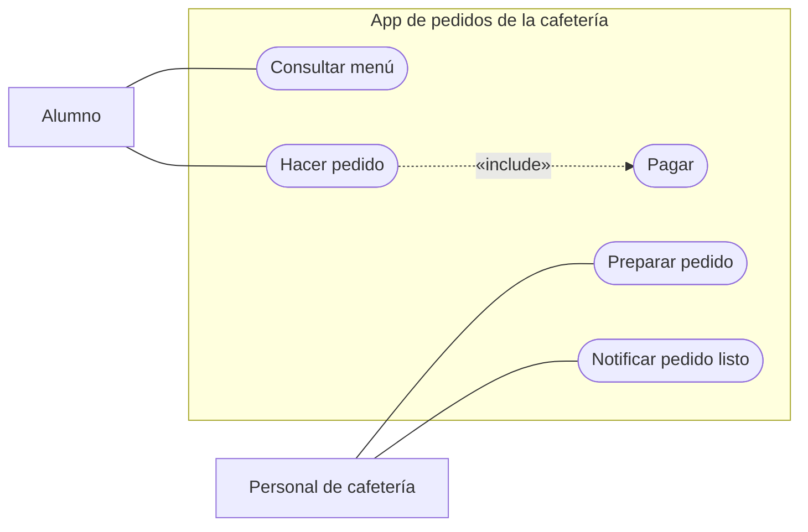
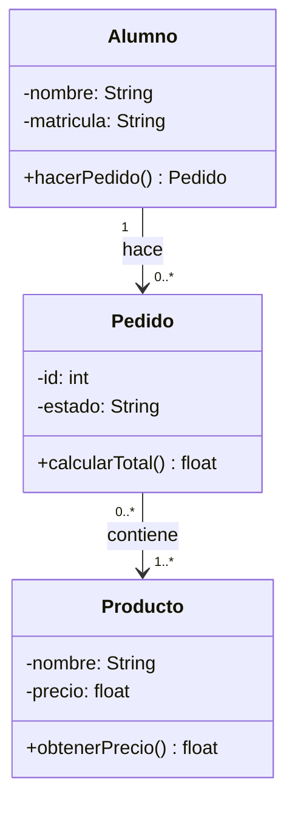
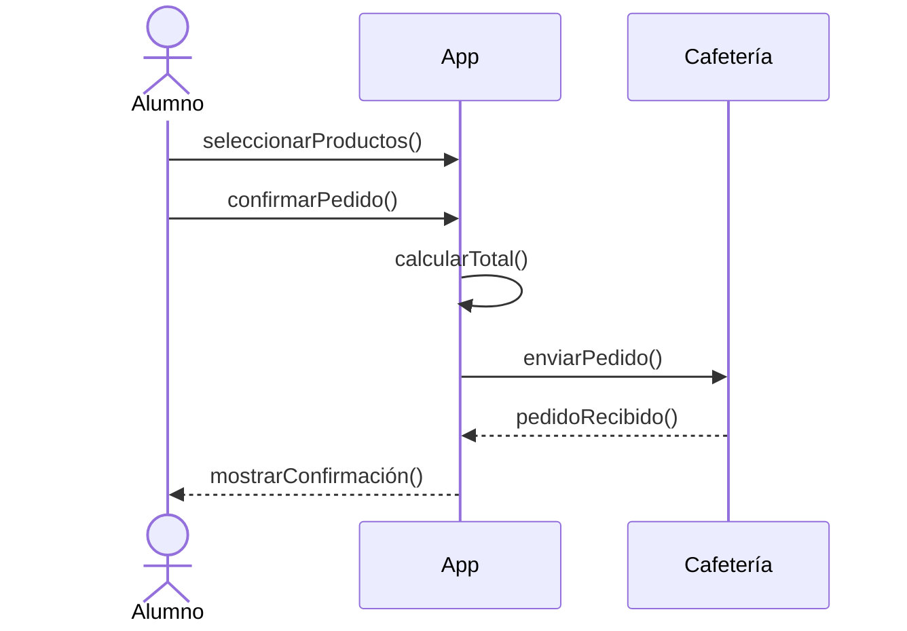

## 1. Diagrama de casos de uso

```mermaid
flowchart LR
    Alumno["Alumno"]
    Personal["Personal de cafetería"]

    subgraph Sistema["App de pedidos de la cafetería"]
        CU1([Consultar menú])
        CU2([Hacer pedido])
        CU3([Pagar])
        CU4([Preparar pedido])
        CU5([Notificar pedido listo])
    end

    Alumno --- CU1
    Alumno --- CU2
    Personal --- CU4
    Personal --- CU5

    CU2 -. "«include»" .-> CU3
```

## 2. Diagrama de clases

```mermaid
classDiagram
    class Alumno {
        -nombre: String
        -matricula: String
        +hacerPedido() Pedido
    }

    class Pedido {
        -id: int
        -estado: String
        +calcularTotal() float
    }

    class Producto {
        -nombre: String
        -precio: float
        +obtenerPrecio() float
    }

    Alumno "1" --> "0..*" Pedido : hace
    Pedido "0..*" --> "1..*" Producto : contiene
```

## 3. Diagrama de secuencia: "Hacer un pedido"

```mermaid
sequenceDiagram
    actor Alumno
    participant App
    participant Cafeteria as Cafetería

    Alumno->>App: seleccionarProductos()
    Alumno->>App: confirmarPedido()
    App->>App: calcularTotal()
    App->>Cafeteria: enviarPedido()
    Cafeteria-->>App: pedidoRecibido()
    App-->>Alumno: mostrarConfirmación()
```
