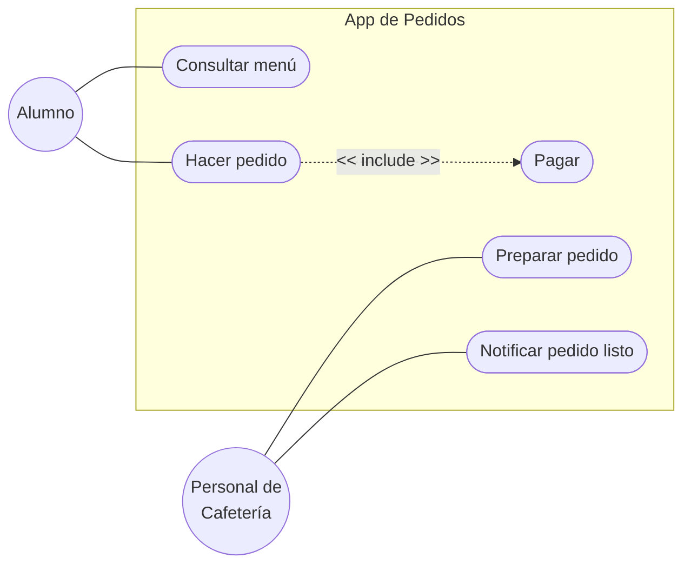
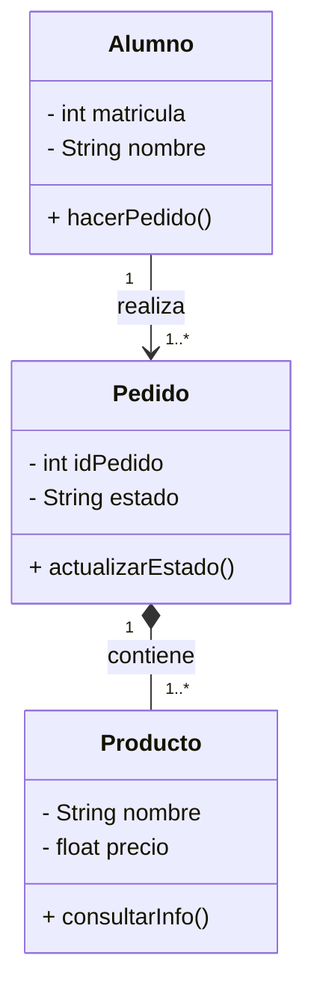
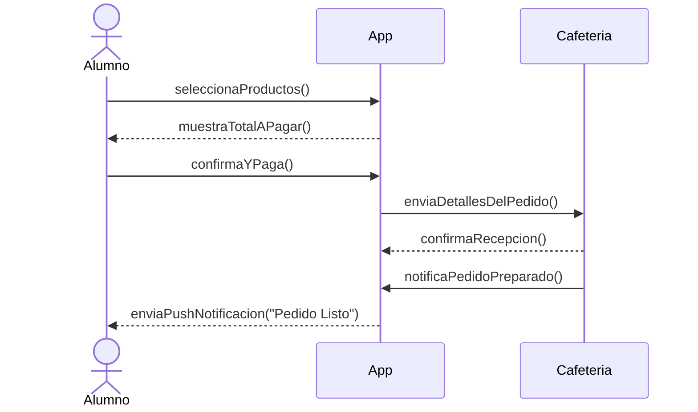

# Diagramas UML - App de Pedidos

Paso 1: Diagrama de Casos de Uso

```mermaid
flowchart LR
    %% Actores
    Alumno((Alumno))
    Personal((Personal de\nCafetería))

    %% Límite del Sistema
    subgraph App de Pedidos
        UC1([Consultar menú])
        UC2([Hacer pedido])
        UC3([Pagar])
        UC4([Preparar pedido])
        UC5([Notificar pedido listo])
    end

    %% Relaciones
    Alumno --- UC1
    Alumno --- UC2
    
    %% Relación Include
    UC2 -. "<< include >>" .-> UC3
    
    Personal --- UC4
    Personal --- UC5
```

Paso 2: Diagrama de Clases

```mermaid
classDiagram
    class Alumno {
        - int matricula
        - String nombre
        + hacerPedido()
    }
    
    class Pedido {
        - int idPedido
        - String estado
        + actualizarEstado()
    }
    
    class Producto {
        - String nombre
        - float precio
        + consultarInfo()
    }

    %% Relaciones y multiplicidad
    Alumno "1" --> "1..*" Pedido : realiza
    Pedido "1" *-- "1..*" Producto : contiene
```

Paso 3: Diagrama de Secuencia

```mermaid
sequenceDiagram
    actor Alumno
    participant App
    participant Cafeteria

    %% Escenario: Hacer un pedido
    Alumno->>App: seleccionaProductos()
    App-->>Alumno: muestraTotalAPagar()
    Alumno->>App: confirmaYPaga()
    
    App->>Cafeteria: enviaDetallesDelPedido()
    Cafeteria-->>App: confirmaRecepcion()
    
    Cafeteria->>App: notificaPedidoPreparado()
    App-->>Alumno: enviaPushNotificacion("Pedido Listo")
```